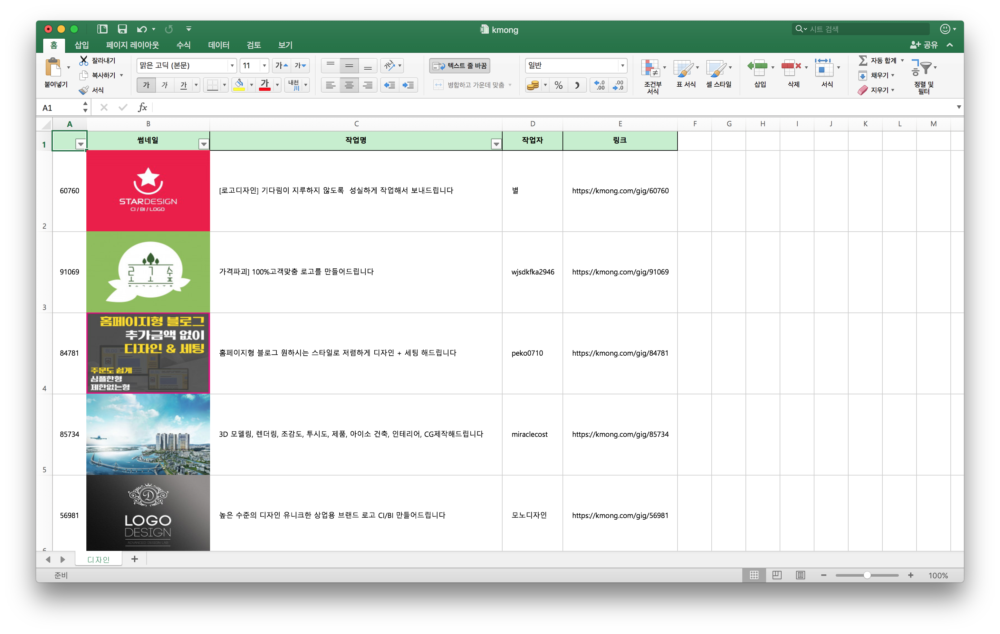

# 기획자/마케터 역량 강화를 위한 프로그래밍 (1, 2주차)

앞으로 본 캠프 강의에서 사용할 언어인 파이썬에 대해 학습하고, 직접 외부 사이트의 데이터를 크롤링하고 엑셀 데이터로 만드는 방법에 대해 실습합니다.

## 1주차 (Python 문법 학습 및 개발 환경 구축하기)

### 개발환경 구성

- brew를 사용한 구성 (macOS)
- anaconda를 사용한 구성 (Windows)

### 파이썬 문법 학습

- 변수
- 숫자
- 문자열
- 시퀀스
- 딕셔너리, 셋
- 제어문
- 함수
- 파일 입출력

## 2주차 (크롤링 및 엑셀로 출력하기)

- HTTP라이브러리 requests를 사용해 HTML데이터 가져오기
- BeautifulSoup 라이브러리를 이용해 파이썬 데이터로 번역(파싱)하기
- Excel 라이브러리 XlsxWriter 를 사용해 파이썬 데이터를 엑셀파일로 출력하기

## 실습 결과물

**외부 사이트**  


**크롤링 결과를 엑셀파일로 정리**  



## 명령어

### (맥) 필요 패키지 설치 명령어

```
pip3 install requests BeautifulSoup4 XlsxWriter
```

### Jupyter notebook 실행

윈도 사용자는 `시작->실행->powershell` 로 터미널 실행

맥 사용자는 오른쪽 위 돋보기모양 아이콘 누른 후 `terminal`입력 후 엔터로 터미널 실행

```
cd ~/projects/python
jupyter notebook
```

### 프로젝트 폴더로 가는법

#### 맥

```
cd ~/projects/python
open .
```

#### 윈도

```
내 컴퓨터 -> C드라이브 -> 사용자 -> <자신이 쓰고있는 계정명> -> projects -> python
```